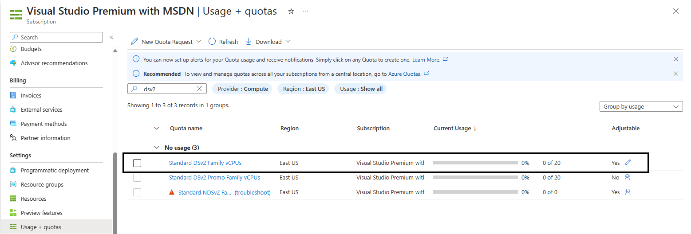
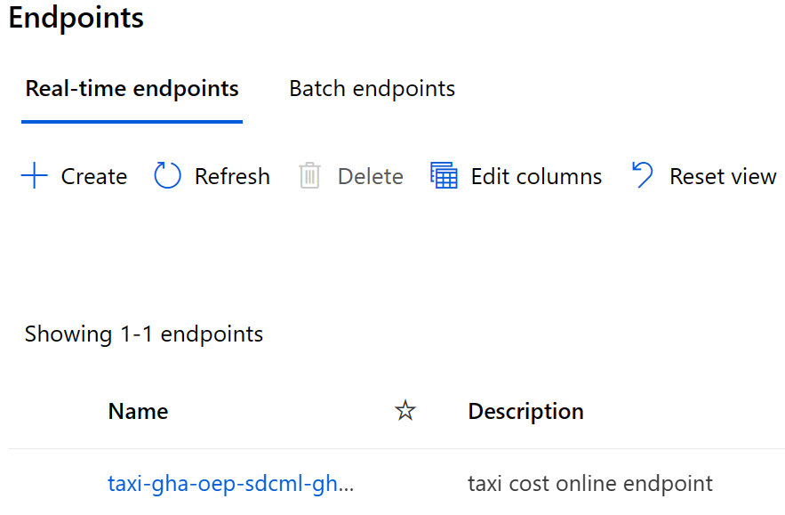

# Deployment Guide using GitHub Repositories Workflows

## Table of Contents

- [Technical Requirements](#technical-requirements)
- [Configure The GitHub Environment](#configure-the-github-environment)
- [Deploy Machine Learning Project Infrastructure Using GitHub Actions](#deploy-machine-learning-project-infrastructure-using-github-actions)
- [Sample Training and Deployment Scenario](#sample-training-and-deployment-scenario)
  - [Prepare Data](#prepare-data)
  - [Train Model](#train-model)
  - [Evaluate Model](#evaluate-model)
  - [Register Model](#register-model)
- [Deploying the Model Training Pipeline to the Test Environment](#deploying-the-model-training-pipeline-to-the-test-environment)
- [Deploying the Trained Model in Development](#deploying-the-trained-model-in-development)
  - [Online Endpoint](#online-endpoint)
  - [Batch Endpoint](#batch-endpoint)
- [Moving to Production](#moving-to-production)
- [Next Steps](#next-steps)

## Technical Requirements <a id="technical-requirements"></a>

- GitHub as the source control repository
- GitHub Actions as the DevOps orchestration tool
- [GitHub Client](https://cli.github.com/)
- [Azure CLI](https://learn.microsoft.com/en-us/cli/azure/install-azure-cli)
- One or more Azure subscription(s) based on whether you are deploying `Prod` only or `Prod` and `Dev` environments

> [!IMPORTANT]
> As mentioned in the Prerequisites at the beginning [here](../../README.md#prerequisites), if you plan to use either a Free/Trial or similar learning purpose subscriptions, they might pose **Usage + quotas** limitations in the default Azure region being used for deployment. Please read provided instructions carefully to succeessfully execute this deployment.

- Azure service principals to access/create Azure resources from Azure DevOps or GitHub Actions (or the ability to create them)
- Git bash, [WSL](https://learn.microsoft.com/en-us/windows/wsl/install) or another shell script runner on your local machine

> [!NOTE]
> When using WSL, make sure to completely work in the context of the Unix environment (cloning of the repository, defining the file paths, etc.). You can then connect to this environment with VSCode (if that is your editor) if you install the [Remote - SSH](https://marketplace.visualstudio.com/items?itemName=ms-vscode-remote.remote-ssh) extension.
>
> - dos2unix: `sudo apt-get install dos2unix`
> - Set up GitHub CLI (mentioned above) (or via `sudo apt-get install gh`)
> - Login to GitHub: `gh auth login`
> - Config Git locally: `git config --global user.email "youremail@example.com"` and `git config --global user.name "Your Name"`
>
> Git version 2.27 or newer is required. See these [instructions](https://github.com/cli/cli/blob/trunk/docs/install_linux.md#debian-ubuntu-linux-raspberry-pi-os-apt) to upgrade.

## Configure The GitHub Environment <a id="configure-the-github-environment"></a>

1. **Replicate MLOps-V2 Template Repositories in your GitHub Organization**

   Head to https://github.com/Azure/mlops-templates/fork to fork the `mlops-templates` repository into your GitHub Organization. This repository has reusable MLOps code that can be used across multiple projects.

   

   Head to https://github.com/Azure/mlops-project-template/generate to create a repository in your GitHub Organization using the `mlops-project-template`. This is the monorepo that you will use to pull example projects from in a later step.

   

2. **Clone the `mlops-v2` repository to local system**

   On your local machine, select or create a root directory (e.g. `mlprojects/`) to hold your project repository as well as the `mlops-v2` repository. Change to this directory by running:

   ```bash
   cd /path/to/mlprojects
   ```

   Clone the [`mlops-v2`](https://github.com/Azure/mlops-v2) repository into this directory by running:

   ```bash
   git clone https://github.com/Azure/mlops-v2.git
   ```

   This provides the documentation and the [`sparse_checkout.sh`](../../sparse_checkout.sh) script. This repository and folder will be used to bootstrap your projects.

> [!NOTE]
> If your organization has already created a repository from the `mlops-v2` [template](https://github.com/new?template_name=mlops-v2&template_owner=Azure), you can instead clone from that repository instead:
>
> ```bash
> git clone https://github.com/<github_org_name>/mlops-v2.git
> ```

3. **Configure and run sparse checkout**

   From your local project root directory, open the `sparse_checkout.sh` in the newly cloned `mlops-v2` repository for editing. Edit the following variables as needed to select the infastructure management tool used by your organization, the type of project etc. Open this file in an editor and set the following variables:

   - `infrastructure_version`: Selects the tool that will be used to deploy cloud resources.
   - `project_type`: Selects the AI workload type for your project (classical ml, computer vision, or natural language processing).
   - `mlops_version`: Selects your preferred interaction approach with Azure Machine Learning.
   - `git_folder_location`: Points to the root project directory to which you cloned `mlops-v2` to in step 2.
   - `project_name`: The name (case sensitive) of your project. A GitHub repository will be created with this name.
   - `github_org_name`: The name of your GitHub organization (or GitHub username).
   - `project_template_github_url`: The URL to the original or your generated clone of the `mlops-project-template` repository from step 1.
   - `orchestration`: Specifies the CI/CD orchestration to use. Either Azure DevOps or GitHub Actions.

   A [`sparse_checkout.sh`](../../sparse_checkout.sh) example is below:

   ```bash
   # options: terraform / bicep
   infrastructure_version=terraform

   # options: classical / cv / nlp
   project_type=classical

   # options: python-sdk / aml-cli-v2
   mlops_version=aml-cli-v2

   # replace with the local root folder location where you want
   git_folder_location='/home/<username>/mlprojects'

   # replace with your project name
   project_name=<project-name>

   # replace with your github org name
   github_org_name=<organization-name>

   # replace with the url for the project template for your organization created in step 1
   project_template_github_url=https://github.com/azure/mlops-project-template

   # options: github-actions / azure-devops
   orchestration=github-actions
   ```

> [!IMPORTANT]
> Currently, the following pipelines are supported:
>
> - `classical`
> - `cv` (computer vision)
> - `nlp` (natural language processing)

> [!NOTE]
> When running the script through a "vanilla" WSL, you'll most likely get strange errors. In that case it might suffice to use `dos2unix` on the file (in WSL) run; `dos2unix sparse_checkout.sh` (in the` mlops-v2` repository folder).

4. **Configure GitHub SSH authentication**

   The `sparse_checkout.sh` script will use `SSH` to authenticate to your GitHub Organization. If this is not yet configured in your environment, follow the steps below or refer to the documentation at [GitHub Key Setup](https://docs.github.com/en/authentication/connecting-to-github-with-ssh/generating-a-new-ssh-key-and-adding-it-to-the-ssh-agent):

   - On your local machine, create a new SSH key:

     ```bash
     ssh-keygen -t ed25519 -C "<youremail@example.com>"
     ```

     You may press enter to all three prompts to create a new key in `/home/<username>/.ssh/id_ed25519`.

   - Add your SSH key to your SSH agent:

     ```bash
     eval "$(ssh-agent -s)"
     ssh-add ~/.ssh/id_ed25519
     ```

   - Get your public key to add to GitHub:

     ```bash
     cat ~/.ssh/id_ed25519.pub
     ```

     It will be a string of the format `ssh-ed25519 ... your_email@example.com`. Copy this string.

   - [Add your SSH key to Github](https://docs.github.com/en/authentication/connecting-to-github-with-ssh/adding-a-new-ssh-key-to-your-github-account). Under your account menu, select **Settings**, then **SSH and GPG Keys**. Select **New SSH key** and enter a title. Paste your public key into the key box and click **Add SSH key**.

5. **Configure GitHub Actions Secrets**

   This step creates a service principal and GitHub secrets to allow the GitHub action workflows to create and interact with Azure Machine Learning Workspace resources.

   From the command line, execute the following Azure CLI command with your choice of a service principal name:

   ```bash
   az ad sp create-for-rbac --name <service-principal-name> \
      --role contributor \
      --scopes /subscriptions/<subscription-id> \
      --sdk-auth
   ```

   You will get output similar to below:

   ```bash
   {
    "clientId": "<Service Principal Client ID>",
    "clientSecret": "<Service Principal Client Secret>",
    "subscriptionId": "<Azure Subscription ID>",
    "tenantId": "<Azure Tenant ID>",
    "activeDirectoryEndpointUrl": "https://login.microsoftonline.com",
    "resourceManagerEndpointUrl": "https://management.azure.com/",
    "activeDirectoryGraphResourceId": "https://graph.windows.net/",
    "sqlManagementEndpointUrl": "https://management.core.windows.net:8443/",
    "galleryEndpointUrl": "https://gallery.azure.com/",
    "managementEndpointUrl": "https://management.core.windows.net/"
   }
   ```

   - **(Option 1) Set secrets in GitHub**

     Copy all of this output, braces included. From your GitHub project, select **Settings**:

     

     Then select **Secrets**, then **Actions**:

     

     Select **New repository secret**. Name this secret `AZURE_CREDENTIALS` and paste the service principal output as the content of the secret. Select **Add secret**. The GitHub configuration is completed.

   - **(Option 2) Set secrets in `.env` file**

     Rename the [`.env.sample`](../../.env.sample) file to `.env` or copy and paste the content into another file named `.env`.

     ```yml
     # Replace these values
     clientSecret=******
     subscriptionId=******
     tenantId=******
     clientId=******
     ```

> [!NOTE]
> If deploying the infrastructure using terraform, add the following additional GitHub secrets using the corresponding values from the service principal output as the content of the secret:
>
> - `ARM_CLIENT_ID`
> - `ARM_CLIENT_SECRET`
> - `ARM_SUBSCRIPTION_ID`
> - `ARM_TENANT_ID`

6. **(Optional) Configure security alerts**

   Next, you can optionally configure the security alerts for Dependabot to check for vulnerabilities in your dependencies. For more information, refer to [Dependabot Security Updates](https://docs.github.com/en/code-security/dependabot/dependabot-security-updates/about-dependabot-security-updates).

   Head to **Settings**, under **Security** in the left panel, click on **Code security**.

   

   Enable the following:

   - **Dependency graph**
   - **Dependabot alerts**
   - **Dependabot security updates**
   - **Grouped security updates**

7. **Run sparse checkout**

   Finally, run the `sparse_checkout.sh` script. From your root project directory (e.g. `mlprojects/`), execute the `sparse_checkout.sh` script:

   ```bash
   chmod +x ./mlops-v2/sparse_checkout.sh
   ./mlops-v2/sparse_checkout.sh
   ```

   This will run the script, using `git sparse checkout` to build a local copy of your project repository based on your choices configured in the script. It will then create the GitHub repository and push the project code to it.

   Monitor the script execution for any errors. If there are errors, you can safely remove the local copy of the repository (e.g. `<project-name>/`) as well as delete the GitHub project repository. After addressing the errors, run the script again.

   After the script runs successfully, the GitHub project will be initialized with your project files.

## Deploy Machine Learning Project Infrastructure Using GitHub Actions <a id="deploy-machine-learning-project-infrastructure-using-github-actions"></a>

1. **Configure Azure Machine Learning Environment Parameters**

   In your GitHub project repository (e.g. `<project-name>`), there are two configuration files in the root, `config-infra-dev.yml` and `config-infra-prod.yml`. These files are used to define and deploy `Dev` and `Prod` Azure Machine Learning environments. With the default deployment, `config-infra-prod.yml` will be used when working with the `main` branch or your project and `config-infra-dev.yml` will be used when working with any non-`main` branch.

   It is recommended to first create a `dev` branch from `main` and deploy this environment first.

   Edit the `config-infra-prod.yml` and `config-infra-dev.yml` files to configure a `namespace`, `postfix` string, Azure `location`, and `environment` for deploying your development and production Azure Machine Learning environments. Default values and settings in the files are show below:

   ```yml
   namespace: mlopsv2 # Note: A namespace with many characters will cause storage account creation to fail due to storage account names having a limit of 24 characters.
   postfix: 0001
   location: eastus
   environment: dev
   enable_aml_computecluster: true
   enable_monitoring: false
   ```

   The first four values are used to create globally unique names for your Azure environment and contained resources. Edit these values to your liking then save, commit, push, or create a PR to update these files in the project repository.

   If you are running a Deep Learning workload such as CV or NLP, ensure your subscription and Azure location has available GPU compute.

> [!NOTE]
> The `enable_monitoring` flag in these files defaults to `false`. Enabling this flag will add additional elements to the deployment to support Azure Machine Learning monitoring based on https://github.com/microsoft/AzureML-Observability. This will include an ADX cluster and increase the deployment time and cost of the MLOps solution.

> [!IMPORTANT]
> The `config-infra-prod.yml` and `config-infra-dev.yml` files use default region as `eastus` to deploy resource group and Azure Machine Learning Workspace. If you are using Free/Trial or similar learning purpose subscriptions, you must do one of the following:
>
> 1. If you decide to use `eastus` region, ensure that your subscription(s) have a quota/limit of up to 20 vCPUs for **Standard DSv2 Family vCPUs**. Visit Subscription page in Azure Portal as show below to validate this.
>    
>
> 2. If not, you should change it to a region where **Standard DSv2 Family vCPUs** has a quota/limit of up to 20 vCPUs.
> 3. You may also choose to change the region and compute type being used for deployment. To do this you have to change region in `config-infra-prod.yml` and `config-infra-dev.yml`, and additionally search for `STANDARD_DS3_V2` in below listed DevOps pipeline files and change this with a compute type that would work for your setup.
>
> - `deploy-model-training-pipeline.yml`
> - `deploy-batch-endpoint-pipeline.yml`
> - `online-deployment.yml`

2. **Deploy Azure Machine Learning Infrastructure**

   In your GitHub project repository (e.g. `<project-name>`), select **Actions**:

   

   This will display the pre-defined GitHub workflows associated with your project. For a classical machine learning project, the available workflows will look similar to this:

   

   Depending on the the use case, available workflows may vary. Select the workflow to `deploy-infra`. In this scenario, the workflow to select would be `tf-gha-deploy-infra.yml`. This would deploy the Azure Machine Learning infrastructure using GitHub Actions and Terraform.

   

   On the right side of the page, select **Run workflow** and select the branch to run the workflow on. This may deploy `Dev` Infrastructure if you've created a `dev` branch or `Prod` infrastructure if deploying from `main`. Monitor the pipeline for successful completion.

   

   When the pipeline has completed successfully, you can find your Azure Machine Learning Workspace and associated resources by logging in to the Azure Portal.

   Next, a model training and scoring pipelines will be deployed into the new Azure Machine Learning environment.

## Sample Training and Deployment Scenario <a id="sample-training-and-deployment-scenario"></a>

The solution accelerator includes code and data for a sample end-to-end machine learning pipeline which runs a linear regression to predict taxi fares in NYC. The pipeline is made up of components, each serving different functions, which can be registered with the workspace, versioned, and reused with various inputs and outputs. Sample pipelines and workflows for the Computer Vision and NLP scenarios will have different steps and deployment steps.

This training pipeline contains the following steps:

### Prepare Data <a id="prepare-data"></a>

This component takes multiple taxi datasets (yellow and green) and merges/filters the data, and prepare the train/val and evaluation datasets.

**Input**: Local data under `./data/` (multiple `.csv` files)
**Output**: Single prepared dataset (`.csv`) and train/val/test datasets.

### Train Model <a id="train-model"></a>

This component trains a Linear Regressor with the training set.

**Input**: Training dataset
**Output**: Trained model (pickle format)

### Evaluate Model <a id="evaluate-model"></a>

This component scores the model based on how accurate the predictions are in the test set.

**Input**: Machine Learning model and Test dataset
**Output**: Performance of model and a deploy flag whether to deploy or not.

This component compares the performance of the model with all previous deployed models on the new test dataset and decides whether to promote the model or not into production. Promoting model into production happens by registering the model in Azure Machine Learning Workspace.

### Register Model <a id="register-model"></a>

This component scores the model based on how accurate the predictions are in the test set.

**Input**: Trained model and the deploy flag.
**Output**: Registered model in Azure Machine Learning.

## Deploying the Model Training Pipeline to the Test Environment <a id="deploying-the-model-training-pipeline-to-the-test-environment"></a>

Next, you will deploy the model training pipeline to your new Azure Machine Learning Workspace. This pipeline will create a compute cluster instance, register a training environment defining the necessary Docker image and Python packages, register a training dataset, then start the training pipeline described in the last section. When the job is completed, the trained model will be registered in the Azure Machine Learning Workspace and be available for deployment.

In your GitHub project repository (e.g. `<project-name>`), select **Actions**:


Select the `deploy-model-training-pipeline` from the workflows listed on the left and the click **Run Workflow** to execute the model training workflow. This will take several minutes to run, depending on the compute size.


Once completed, a successful run will register the model in the Azure Machine Learning Workspace.

> [!NOTE]
> If you want to check the output of each individual step, for example to view output of a failed run, click a job output, and then click each step in the job to view any output of that step.


With the trained model registered in the Azure Machine Learning Workspace, you are ready to deploy the model for scoring.

## Deploying the Trained Model in Development <a id="deploying-the-trained-model-in-development"></a>

This scenario includes prebuilt workflows for two approaches to deploying a trained model, batch scoring or a deploying a model to an endpoint for real-time scoring. You may run either or both of these workflows in your `dev` branch to test the performance of the model in your `Dev` Azure Machine Learning workspace.

In your GitHub project repository (e.g. `<project-name>`), select **Actions**:


### Online Endpoint <a id="online-endpoint"></a>

Select the `deploy-online-endpoint-pipeline` from the workflows listed on the left and click **Run workflow** to execute the online endpoint deployment pipeline workflow. The steps in this pipeline will create an online endpoint in your Azure Machine Learning Workspace, create a deployment of your model to this endpoint, then allocate traffic to the endpoint.


Once completed, you will find the online endpoint deployed in the Azure Machine Learning Workspace and available for testing.



### Batch Endpoint <a id="batch-endpoint"></a>

Select the `deploy-batch-endpoint-pipeline` from the workflows and click **Run workflow** to execute the batch endpoint deployment pipeline workflow. The steps in this pipeline will create a new `AmlCompute` cluster on which to execute batch scoring, create the batch endpoint in your Azure Machine Learning Workspace, then create a deployment of your model to this endpoint.


Once completed, you will find the batch endpoint deployed in the Azure Machine Learning Workspace and available for testing.


## Moving to Production <a id="moving-to-production"></a>

Example scenarios can be trained and deployed both for development to production environments. When you are satisfied with the performance of the model training pipeline, model, and deployment in `Testing` or `Dev` pipelines, then the models can be replicated and deployed in the production environment.

The sample training and deployment Azure Machine Learning pipelines and GitHub workflows can be used as a starting point to adapt your own modeling code and data.

## Next Steps <a id="next-steps"></a>

This finishes the demo according to the architectural pattern: Azure Machine Learning Classical Machine Learning. Next you can dive into your Azure Machine Learning service in the Azure Portal and see the inference results of this example model.

As elements of Azure Machine Learning are still in development, the following components are not part of this demo:

- Model and pipeline promotion from development to production
- Secure Workspaces
- Model Monitoring for Data/Model Drift
- Automated Retraining
- Model and Infrastructure Triggers

Interim it is recommended to schedule the deployment pipeline for development for complete model retraining on a timed trigger.

For questions, please [submit an issue](https://github.com/0Upjh80d/mlops-v2/issues).
