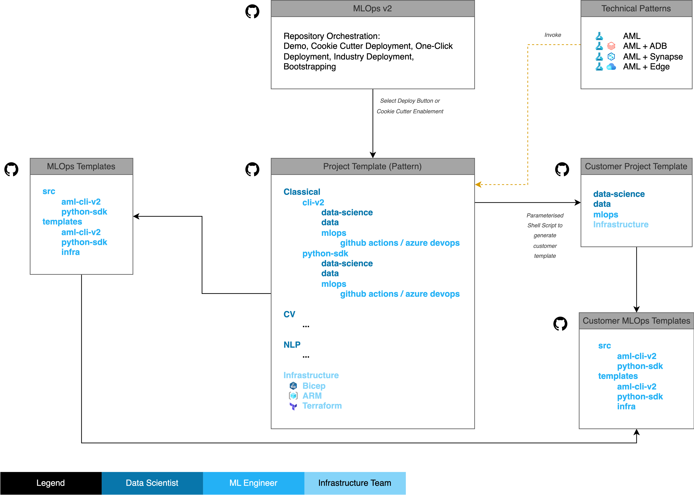

# Solution Accelerator Structure and Implementation

The solution accelerator is not a product but rather an adaptable framework for bootstrapping end-to-end machine learning projects based on defined patterns using the tools your organization uses.

The MLOps pattern the solution accelerator deploys is broadly organized into two loops, an inner loop and an outer loop:

- **Inner loop**: Data Scientists iterate over data wrangling, model development, and experimentation.
- **Outer loop**: Infrastructure and ML Engineers implement CI/CD patterns to orchestrate the model through testing, staging, production, and monitoring.

> [!NOTE]
> This solution accelerator focuses on implementing end-to-end MLOps from model development through deployment. Beyond light data wrangling and feature engineering that may occur within the inner loop, the accelerator does not address DataOps and larger scale data engineering.

## Repositories

The solution accelerator itself is comprised of three code repositories with templates that allow you to bootstrap a new machine learning project based on your choices of infrastructure management, MLOps orchestration, and ML project use case:

1. [Azure/mlops-v2](https://github.com/Azure/mlops-v2): This repository defines the deployment starting point and "project factory" for repeatable MLOps projects. This repository is cloned to allow for a local copy of documentation and customization of the project deployment script.

2. [Azure/mlops-template](https://github.com/Azure/mlops-templates): This repository defines templates for MLOps pipelines and actions such as training, model registration, deployment, etc. using either the CLI or SDK. This repository is forked into your organization to provide mlops pipelines that may be modified and reused across multiple projects or kept in sync with the parent repository as updates are made to accomodate new function in Azure Machine Learning.

3. [Azure/mlops-project-template](https://github.com/Azure/mlops-project-template): This repository defines templates for deploying infastructure based on Bicep or Terraform as well as project spaces appropriate to each project type ([classical-ml](https://github.com/Azure/mlops-project-template/tree/main/classical), [computer vision](https://github.com/Azure/mlops-project-template/tree/main/cv), [natural language processing](https://github.com/Azure/mlops-project-template/tree/main/nlp)). A copy of this repository is generated from a template of base infrastructure deployment patterns which can be modified to suit the requirements of your organization.

A diagram of the repositories and their relationships is below:



## Defining A New ML Project

A new MLOps project is bootstrapped by configuring and running the [`sparse_checkout.sh`](../../sparse_checkout.sh) script in the main repository.

Configuration options at the top of the `sparse_checkout.sh` script are:

```bash
infrastructure_version=terraform   # options: terraform / bicep
project_type=classical      # options: classical / cv / nlp
mlops_version=aml-cli-v2   # options: aml-cli-v2 / python-sdk-v1 / python-sdk-v2 / rai-aml-cli-v2
orchestration=azure-devops # options: github-actions / azure-devops
git_folder_location='path/to/local/root/folder'   # replace with the local root folder location where you want to create the project folder
project_name=project-name   # replace with your project name
github_org_name=organization-name   # replace with your GitHub Organization name
project_template_github_url=https://github.com/azure/mlops-project-template   # replace with the url for the project template for your organization or leave for demo purposes
```

- `infrastructure_version`: Choose the tooling you want to use, terraform or bicep, to manage infrastructure deployment.

- `project_type`: Choose the project type from classical ML on tabular data, computer vision, or natural language processing. A workspace with typical inner loop steps and MLOps pipelines appropriate to these use cases will be created for you.

- `mlops_version`: Choose the implementation approach, CLI or SDK, for interacting with the workspace and defining the mlops pipelines depending on needs or migrating legacy AzureML code.

- `orchestration`: Choose the MLOps orchestration method, either Azure DevOps or GitHub Actions.

- `git_folder_location`: This is a local directory into which your project will be created then pushed to your project repository.

- `project_name`: Project name.

- `github_org_name`: Your GitHub Organization that will host the project source.

- `project_template_github_url`: URL to the GitHub repository containing the MLOps Project Templates to build your projects from. You can leave this as the [default](https://github.com/azure/mlops-project-template) to use the base templates or point to a fork of this repository then modify/define your own templates for your organization.

### Creating the new project through sparse checkout

Once the `sparse_checkout.sh` script is configured, running it will perform a `git sparse checkout` from the template repositories, checking out only the code relevant to your selections in the script. This code is placed into your `git_folder_location` then the new customized project is pushed into your source code repository.
